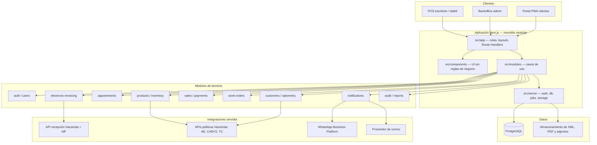
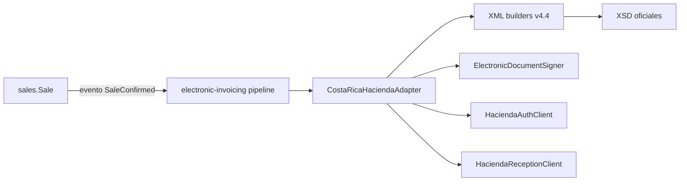
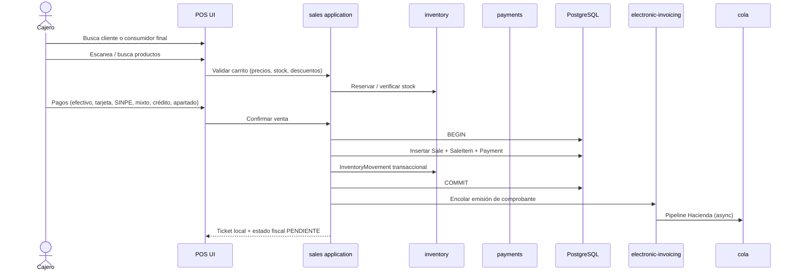
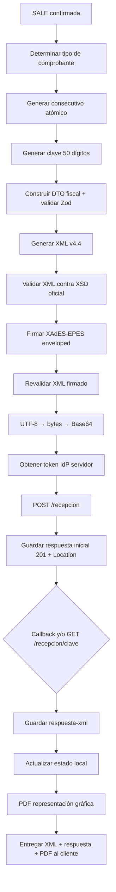
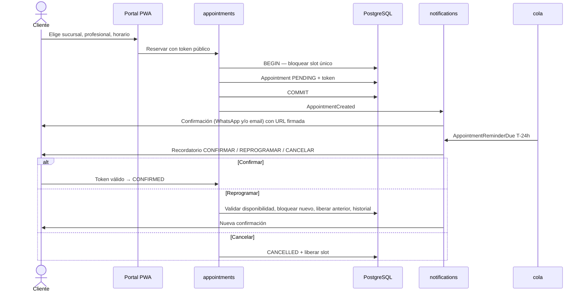

# Arquitectura — Óptica Costa Rica

**Fase:** 0 (diseño). No hay aplicación ejecutándose todavía.  
**Repositorio inspeccionado el 2026-09-08:** un único commit (`# sql`), sin `package.json`, sin Prisma, sin código de producto.  
**Idioma de interfaz:** español. **Zona horaria:** `America/Costa_Rica`. **Moneda principal:** CRC.

Este documento propone la arquitectura de un sistema de producción para una óptica en Costa Rica. No es una maqueta: fija límites, módulos, flujos y lo que queda pendiente de aprobación.

---

## 1. Principios

1. **Monolito modular**, no microservicios. Un proceso Next.js, una base PostgreSQL, un bus de trabajos sobre la misma base.
2. **La UI no contiene reglas de negocio.** React renderiza; los módulos en `/src/modules` ejecutan casos de uso.
3. **El POS no conoce Hacienda.** El módulo `sales` emite una venta; el módulo `electronic-invoicing` decide tipo de comprobante, construye XML, firma, envía y persiste evidencia.
4. **Los documentos fiscales aceptados son inmutables.** Un ajuste posterior es nota de crédito o débito, nunca edición del XML firmado.
5. **Nada fiscal se inventa.** Clave, consecutivo, XSD, firma, URLs y JSON de recepción salen de copias oficiales en `/docs/hacienda/`.
6. **Dinero con Decimal/NUMERIC.** Cero `number` de JavaScript en totales, impuestos y redondeos fiscales.
7. **Secretos solo en servidor.** Tokens de Hacienda, P12 y contraseñas no llegan al navegador ni a logs.
8. **Multi-sucursal desde el día uno en el modelo**, aunque el primer despliegue sea una sucursal.
9. **No se habilita un tipo de comprobante hasta que su builder, XSD, firma y sandbox estén verdes.**

---

## 2. Stack propuesto (a pinnear en Fase 1)

Versiones exactas se fijan al iniciar Fase 1 contra el registro npm vigente. Orientación al 2026-09-08:

| Capa | Tecnología | Notas |
| --- | --- | --- |
| Runtime | Node.js LTS vigente | Verificar LTS al iniciar Fase 1 |
| App | Next.js 16 (estable) + React + TypeScript `strict` | App Router. No Pages Router. |
| UI | Tailwind CSS + shadcn/ui | Español, escritorio y tablet primero |
| Validación | Zod | En frontera HTTP y en DTOs de dominio |
| ORM | Prisma + PostgreSQL | Migraciones versionadas; nunca destructivas automáticas |
| Dinero | `Prisma.Decimal` + `decimal.js` | Política central en `/src/lib/money` |
| Auth | Sesiones en servidor (ver decisión D-01) | Cookies httpOnly; Argon2id; MFA preparado, no activo |
| Jobs | Cola PostgreSQL (pg-boss o Graphile Worker) | Recordatorios, poll de Hacienda, reintentos |
| Tests | Vitest + Playwright + Testcontainers PostgreSQL | Ver `/docs/TESTING.md` |
| PDF | Generación servidor (decisión D-07) | Representación gráfica ≠ comprobante fiscal |

**No se usará** scraping de WhatsApp Web, ni firma XAdES casera, ni `MAX(consecutivo)+1` sin bloqueo.

---

## 3. Diagrama lógico



### Separación fiscal



Si Hacienda cambia API o XSD, se versiona un adapter (`v4.4`, `v4.x`) sin reescribir ventas.

---

## 4. Estructura de carpetas propuesta

No se crea el árbol de código en Fase 0. Esta es la estructura que se materializará desde Fase 1.

```
/
  docs/
    ARCHITECTURE.md
    ROADMAP.md
    DATABASE.md
    SECURITY.md
    HACIENDA.md
    TESTING.md
    DECISIONS.md
    hacienda/                  # referencias oficiales inmutables
  prisma/
    schema.prisma
    migrations/
  tests/
    unit/
    integration/
    e2e/
    fixtures/fiscal/
  src/
    app/
      (admin)/                 # backoffice + POS autenticado
      (portal)/                # PWA pública de citas
      api/
        hacienda/callback/     # POST servidor, nunca cliente
        whatsapp/webhook/
        health/
    components/                # shadcn + compuestos de UI
    modules/
      auth/
      users/
      branches/
      customers/
      optometry/
      appointments/
      products/
      inventory/
      suppliers/
      purchases/
      sales/
      payments/
      work-orders/
      electronic-invoicing/
        application/
        domain/
        infrastructure/
          costa-rica-hacienda/
            CostaRicaHaciendaAdapter.ts
            HaciendaAuthClient.ts
            HaciendaReceptionClient.ts
            HaciendaKeyGenerator.ts
            HaciendaConsecutiveGenerator.ts
            builders/
            signer/
          schemas/v4.4/        # copia de trabajo de XSD oficiales
        ui/                    # solo pantallas fiscales de admin
      notifications/
      reports/
      audit/
    lib/                       # money, clock, http, cache, logging
    server/                    # prisma, session, jobs, storage
    types/
```

Dentro de cada módulo, cuando la complejidad lo justifique:

```
module/
  domain/           # entidades, eventos, invariantes
  application/      # casos de uso, puertos
  infrastructure/   # Prisma, HTTP, colas
  ui/               # componentes y páginas de ese módulo
```

No se obliga a las cuatro carpetas en módulos triviales (p. ej. `brands`). Sí son obligatorias en `sales`, `inventory`, `electronic-invoicing`, `appointments` y `auth`.

---

## 5. Capas y reglas de dependencia

```
app / components  →  modules/*/ui  →  modules/*/application  →  modules/*/domain
                                          ↓
                               modules/*/infrastructure
                                          ↓
                         server (prisma, clock, mailer, storage)
```

- `domain` no importa Next.js, Prisma ni React.
- `application` no importa componentes React.
- Route Handlers y Server Actions solo orquestan: parsean Zod, invocan un caso de uso, mapean el resultado.
- El reloj de negocio es inyectable (`Clock`) para pruebas y para `America/Costa_Rica`.

---

## 6. Identificadores públicos

- Claves primarias internas: UUID (`UUIDv7` preferido).
- La PWA y URLs de confirmación de citas **no** exponen enteros incrementales.
- Citas públicas, reprogrames y cancelaciones usan token firmado con expiración.
- Consecutivo y clave de Hacienda son identificadores fiscales, no IDs de aplicación.

---

## 7. Flujo completo de una venta (POS)



Reglas de este flujo:

1. Precio, impuesto y CABYS se **copian** a la línea de venta. Un cambio posterior de producto no reescribe ventas cerradas.
2. Stock negativo prohibido salvo permiso explícito de configuración por sucursal.
3. Descuentos requieren autorización (rol + tope). Quedan en `AuditLog`.
4. Apartado y crédito son estados de `Sale` / `PaymentPlan`, no “facturas editables”.
5. El tipo de comprobante (FE vs TE) lo decide `electronic-invoicing` con reglas que se implementarán **solo** a partir del Decreto 44739-H y la resolución vigente — ver decisión D-04.
6. El cajero ve un acuse interno inmediato. **Aceptado por Hacienda** solo cuando `ind-estado = aceptado` (API oficial).

---

## 8. Flujo completo de facturación electrónica

Pipeline obligatorio (el POST HTTP 201 **no** es aceptación):



Estados locales (propios del sistema; no sustituyen el vocabulario de Hacienda):

| Estado local | Significado |
| --- | --- |
| `DRAFT` | DTO en construcción, no hay consecutivo definitivo |
| `GENERATED` | XML sin firmar, validado contra XSD |
| `SIGNED` | XML firmado persistido |
| `QUEUED` | Listo para envío |
| `SENT` | POST `/recepcion` aceptado a nivel HTTP (oficialmente **201** = recibido para validar) |
| `RECEIVED` | `ind-estado = recibido` |
| `PROCESSING` | `ind-estado = procesando` |
| `ACCEPTED` | `ind-estado = aceptado` + XML de respuesta guardado |
| `REJECTED` | `ind-estado = rechazado` |
| `ERROR` | `ind-estado = error` o fallo técnico local |
| `RETRY_PENDING` | Reintento de envío/consulta; **misma clave**, no se emite otro comprobante |

Detalle normativo y contratos JSON: `/docs/HACIENDA.md`.

---

## 9. Flujo completo de una cita



Estados: `PENDING`, `CONFIRMED`, `RESCHEDULED`, `CANCELLED`, `COMPLETED`, `NO_SHOW`.  
Toda transición escribe `AppointmentStatusHistory`.

---

## 10. Jobs y automatización

Cola sobre PostgreSQL (sin Redis obligatorio en v1):

| Job | Disparador |
| --- | --- |
| `hacienda.poll-status` | Documentos en `SENT`, `RECEIVED`, `PROCESSING` |
| `hacienda.retry-send` | Timeouts / 5xx / 429; **misma clave** |
| `appointment.reminder` | 24 h antes |
| `work-order.ready-notify` | Estado `READY_FOR_PICKUP` |
| `exam.annual-reminder` | Próxima revisión óptica |
| `notification.dispatch` | Canal WhatsApp / email |

---

## 11. Observabilidad

- Logs JSON estructurados: `timestamp`, `level`, `requestId`, `userId`, `branchId`, `documentId`, `clave` (cuando exista).
- **Nunca** loguear: password, token, P12, PIN, XML con certificado, `AUTH_SECRET`.
- Tabla `ErrorLog` consultable por administradores (sanitizada).
- Correlación Hacienda: `documentId` + `clave` + `requestId`.

---

## 12. Backups (diseño; implementación en Fase 12)

- PostgreSQL: dumps periódicos + PITR cuando el hosting lo permita.
- XML original, XML firmado y respuesta Hacienda: base de datos **y** almacenamiento de objetos versionado.
- Migraciones Prisma solo forward; rollback = migración nueva, no borrar historial.
- Restauración de un comprobante aceptado nunca implica “regenerar” clave.

---

## 13. Qué no se construye en Fase 0

- No hay `src/`, Prisma schema ejecutable, ni pantallas.
- No hay builders XML ni firma.
- FEC, FEE y REP quedan en el modelo como tipos **deshabilitados**.

Siguiente paso: aprobación de `/docs/DECISIONS.md` y luego Fase 1.
