# Modelo de datos inicial

PostgreSQL. Prisma. Migraciones versionadas. **Ninguna migración destructiva automática.**

Zona horaria de aplicación: `America/Costa_Rica`. En base, timestamps `timestamptz`.  
Dinero: `NUMERIC(18,5)` para campos fiscales (alineado a `DecimalDineroType` del XSD v4.4: `totalDigits=18`, `fractionDigits=5`, `minInclusive=0`). Precios de lista pueden usar la misma precisión. La UI muestra 2 decimales en CRC; el cálculo fiscal no usa `number`.

IDs: `UUID` (UUIDv7). Identificadores fiscales (`clave`, `consecutivo`) son columnas aparte, nunca PK de negocio.

---

## 1. Diagrama lógico por bounded context

```mermaid
erDiagram
  Organization ||--o{ Branch : has
  Organization ||--o{ User : employs
  Role ||--o{ UserRole : grants
  User ||--o{ UserRole : has
  Permission ||--o{ RolePermission : included
  Branch ||--o{ PosTerminal : has
  Branch ||--o{ Inventory : stocks

  Customer ||--o{ CustomerAddress : has
  Customer ||--o{ CustomerContact : has
  Customer ||--o{ CustomerNote : has
  Customer ||--o{ Prescription : has
  Customer ||--o{ Appointment : has
  Customer ||--o{ Sale : has
  Customer ||--o{ Quote : has
  Customer ||--o{ WorkOrder : has
  Customer ||--o{ CustomerTimelineEvent : has

  Professional ||--o{ ProfessionalSchedule : has
  Professional ||--o{ Prescription : signs
  Professional ||--o{ Appointment : attends

  Prescription ||--|{ PrescriptionEyeDetail : eyes
  Prescription ||--o{ PrescriptionAttachment : files

  Appointment ||--o{ AppointmentStatusHistory : history
  Appointment ||--o{ AppointmentService : services

  Brand ||--o{ Product : labels
  ProductCategory ||--o{ Product : classifies
  Product ||--o{ ProductVariant : variants
  ProductVariant ||--o{ Inventory : stock
  Inventory ||--o{ InventoryMovement : moves

  Supplier ||--o{ Purchase : sells
  Purchase ||--o{ PurchaseItem : lines

  Sale ||--o{ SaleItem : lines
  Sale ||--o{ Payment : pays
  Quote ||--o{ QuoteItem : lines
  Sale ||--o{ WorkOrder : produces
  Sale ||--o{ ElectronicDocument : invoices

  WorkOrder ||--o{ WorkOrderItem : lines
  WorkOrder ||--o{ WorkOrderStatusHistory : history

  ElectronicDocument ||--o{ ElectronicDocumentLine : lines
  ElectronicDocument ||--o{ ElectronicDocumentTax : taxes
  ElectronicDocument ||--o{ ElectronicDocumentReference : refs
  ElectronicDocument ||--o{ ElectronicDocumentStatusHistory : history

  NotificationTemplate ||--o{ Notification : uses
  Notification ||--o{ NotificationLog : events
```



---

## 2. Núcleo organizacional y RBAC

### Organization

Una óptica (no multi-tenant SaaS en v1). Datos del **emisor fiscal**: razón social, nombre comercial, tipo y número de identificación, actividad económica CABYS/Hacienda del emisor, correos, teléfonos, ubicación (provincia/cantón/distrito según catálogo oficial cuando se implemente), `proveedorSistemasId` (cédula del proveedor de sistemas o la propia si es desarrollo a la medida, según Anexo 1).

### Branch

Sucursal. Código de establecimiento Hacienda de **3 dígitos** (001 casa matriz, 002+ sucursales) — Anexo 1 Nota 3. Dirección, teléfono, activa. Zona horaria heredada.

### PosTerminal

Punto de venta. Código de terminal Hacienda de **5 dígitos** (`00001` si hay una sola o servidor centralizado) — Nota 3. Pertenece a una sucursal.

### User / Session / Role / Permission / UserRole / RolePermission

- Usuario: nombre, email, hash Argon2id, sucursal por defecto, activo, `mfaEnabled` (false en v1).
- `Session`: token opaco o identificador de sesión, `expiresAt`, `ip` si es legal y se habilita, `userAgent`, revocable.
- Roles iniciales: `SUPER_ADMIN`, `ADMIN`, `MANAGER`, `OPTOMETRIST`, `SALES`, `CASHIER`, `INVENTORY`.
- Permisos granulares (`sale.create`, `sale.discount.authorize`, `inventory.allow_negative`, `hacienda.config.update`, etc.). Un usuario puede tener varios roles.

---

## 3. Clientes y expediente óptico

### Customer

| Campo | Notas |
| --- | --- |
| nombres, apellidos | |
| identificationType, identification | Catálogo alineado a Nota 4 del Anexo cuando el cliente sea receptor fiscal: 01 física, 02 jurídica, 03 DIMEX, 04 NITE, 05 extranjero no domiciliado, 06 no contribuyente. Uso de 05/06 sujeto a las restricciones oficiales del Anexo, no a ocurrencia. |
| birthDate | |
| phone, whatsapp, email | |
| marketingConsent, whatsappConsent, emailConsent | |
| notes / observations | |
| isGenericConsumer | Consumidor final sin crédito fiscal. La legalidad de emitir TE vs FE es decisión D-04. |
| taxpayerSnapshotJson | Copia de `/fe/ae` al momento de consulta, no live. |

UNIQUE suave: identificación no nula por organización (permitir nulos en consumidor genérico).

### CustomerAddress / CustomerContact / CustomerNote

Históricos. Las notas no se editan: se agregan.

### Professional / ProfessionalSchedule

Optometristas y otros. Agenda por sucursal, bloques, excepciones (vacaciones).

### Prescription (inmutable)

Una receta = un examen. **Insert only.** Corrección = nueva receta que referencia la anterior (`supersedesId`).

- `examDate`, `professionalId`, `customerId`, `branchId`
- agudeza visual, observaciones, recomendaciones, tipo de lente recomendado
- `nextReviewAt`
- `createdById`

### PrescriptionEyeDetail

Una fila por ojo (`OD` | `OI`): esfera, cilindro, eje, adición, prisma, DP. Tipos `NUMERIC` con escala óptica (p. ej. 6,2), no float.

### PrescriptionAttachment

Imágenes de receta y archivos. Almacenamiento externo; en DB hash, mime, tamaño, `createdBy`. Acceso con autorización.

### CustomerTimelineEvent

Proyección de citas, exámenes, recetas, cotizaciones, ventas, facturas, pagos, órdenes, entregas, comunicaciones. Se escribe en la misma transacción que el hecho origen. No es la fuente de verdad.

---

## 4. Citas

### Appointment

- `publicToken` (UUID o token opaco UNIQUE)
- sucursal, profesional, cliente (nullable si walk-in interno)
- `startsAt`, `endsAt`, estado
- `rescheduleToken`, `actionTokenExpiresAt`

UNIQUE parcial: un profesional no tiene dos citas solapadas activas (índice de exclusión PostgreSQL `tstzrange` + `WHERE status NOT IN ('CANCELLED','NO_SHOW')`).

### AppointmentStatusHistory / AppointmentService

---

## 5. Productos e inventario

### Brand / ProductCategory

### Product

- `kind`: `FRAME | LENS | CONTACT_LENS | SOLUTION | ACCESSORY | CASE | SERVICE | OTHER`
- SKU, código de barras, nombre, descripción, activo
- `cabysCode` CHAR/VARCHAR 13, `cabysDescription`, `taxRate` NUMERIC copiado de API/catálogo al asignar CABYS
- unidad de medida (catálogo Anexo cuando se facture)
- moneda de precio de lista, `listPrice`, `cost`
- `supplierId` opcional

El IVA de venta **no** se reléé de CABYS en el momento de facturar para reescribir historia; se usa el snapshot de la línea. Sí se puede alertar si el catálogo cambió.

### ProductVariant

Color, talla, material, medidas (montura), índice, tratamiento, fotocromático, filtro, antirreflejo, diseño (progresivo/monofocal/bifocal) según `kind`. Campos ópticos específicos en columnas nulas o tabla de extensión `FrameAttributes` / `LensAttributes` / `ContactLensAttributes` para no hacer un EAV.

Fotografía: URL/objeto storage.

### Inventory

`(variantId, branchId)` UNIQUE. `quantityOnHand`, `quantityReserved`, `minQuantity`.

### InventoryMovement

Inmutable. Tipos: `PURCHASE_IN`, `SALE_OUT`, `ADJUSTMENT`, `TRANSFER`, `RETURN`, `WORK_ORDER_CONSUME`.  
`quantity`, `unitCost`, `saleId`/`purchaseId` opcionales, `createdById`. El saldo se actualiza en la misma transacción.

Nunca borrar movimientos. Ajuste = nuevo movimiento.

### Supplier / Purchase / PurchaseItem

Compras internas de inventario. **No** son Factura Electrónica de Compra (FEC) hasta que ese tipo esté habilitado.

---

## 6. Ventas y pagos

### Quote / QuoteItem

Cotización con caducidad. Puede convertirse en venta (copia de líneas, no vínculo mutable).

### Sale

- sucursal, terminal, cajero, cliente
- estado comercial: `DRAFT | COMPLETED | LAYAWAY | CREDIT | CANCELLED_INTERNAL`
- `currency`, `exchangeRateUsed` (snapshot; no se recalcula)
- subtotal, descuentos, impuestos, total (`NUMERIC(18,5)`)
- `electronicDocumentId` opcional hasta emitir
- **cancelación comercial ≠ anulación fiscal.** Si ya hay documento `ACCEPTED`, el camino es NC/ND.

### SaleItem

Snapshots: descripción, SKU, `cabysCode`, cantidad, precio unitario, descuento, impuesto, totales de línea, `prescriptionId` opcional (lentes).

### Payment

Método: efectivo, tarjeta, transferencia/SINPE, crédito, apartado (catálogo interno; el código de medio de pago **fiscal** se toma del Anexo 1 al emitir, no se inventa aquí).  
Monto, moneda, referencia, `receivedAt`. Pagos mixtos = N filas.

### Layaway / PaymentPlan (si no se modela solo con Sale+Payment)

Abonos contra saldo. El documento fiscal de cada cobro (incluido un futuro REP) se decide en Fases 5–6; v1 puede registrar el abono comercial y dejar el comprobante según D-05.

---

## 7. Órdenes de laboratorio

### WorkOrder

Cliente, venta, receta, laboratorio (supplier o entidad `Lab`), fechas prometida/recibida/entregada, observaciones.

Estados: `CREATED`, `WAITING_LAB`, `SENT_TO_LAB`, `IN_PRODUCTION`, `RECEIVED_FROM_LAB`, `QUALITY_CHECK`, `READY_FOR_PICKUP`, `DELIVERED`.

### WorkOrderItem / WorkOrderStatusHistory

Montura, lentes, medidas copiadas de receta/venta.

---

## 8. Facturación electrónica (inmutable)

### HaciendaConsecutiveCounter

```
UNIQUE (organizationId, establishmentCode, terminalCode, documentTypeCode)
nextValue BIGINT  -- último emitido
```

Emisión: `SELECT … FOR UPDATE` dentro de la transacción que inserta `ElectronicDocument`. **Prohibido** `MAX(consecutivo)+1` sin bloqueo.

`documentTypeCode` según Anexo 1 Nota 3: `01` FE, `02` ND, `03` NC, `04` TE, `08` FEC, `09` FEE, `10` REP. Solo 01–04 habilitados en v1.

### ElectronicDocument

| Campo | Uso |
| --- | --- |
| `clave` UNIQUE 50 dígitos | Nota 3 + `ClaveType` |
| `numeroConsecutivo` 20 dígitos | Nota 3 + `NumeroConsecutivoType` |
| `documentType` | FE/TE/NC/ND (otros existen, flag off) |
| `schemaVersion` | `4.4` |
| emisor/receptor snapshot | JSON o columnas |
| `currency`, `exchangeRateUsed`, `total` | snapshot |
| `localStatus` | DRAFT…RETRY_PENDING |
| `haciendaIndEstado` | `recibido \| procesando \| aceptado \| rechazado \| error` según API oficial |
| `xmlUnsigned`, `xmlSigned` | texto UTF-8; firmado de solo lectura |
| `receptionJson`, `haciendaResponseXml` | evidencia |
| `documentHash` | hash del XML firmado |
| `sentAt`, `acceptedOrRejectedAt` | |
| `saleId` | relación |
| `enabled=false` tipos no implementados | |

UNIQUE `(organizationId, numeroConsecutivo)` y UNIQUE `clave`.  
UPDATE permitido solo para estado, respuestas y timestamps — **no** para XML firmado ni totales. Enforced con trigger o columna `immutable_payload` + permiso de rol.

### ElectronicDocumentLine / Tax / Reference / StatusHistory

Copias fiscales de líneas, impuestos, documentos de referencia (obligatorio en NC/ND según Anexo), y cada transición con timestamp, actor, payload sanitizado.

Almacenamiento de archivos: `clave.xml`, `clave_respuesta.xml`, `clave.pdf` según Nota 3 del Anexo 1.

---

## 9. Notificaciones, auditoría, errores, caché

### NotificationTemplate / Notification / NotificationLog

Plantillas: `appointment_created`, `appointment_reminder`, `appointment_rescheduled`, `appointment_cancelled`, `work_order_ready`, `payment_reminder`, `annual_exam_reminder`.  
Estados de envío: `queued`, `sent`, `delivered`, `read`, `failed`.

### AuditLog

`userId`, `action`, `entityType`, `entityId`, `timestamp`, `branchId`, `oldValue`, `newValue`, `ip`. Sin secretos ni XML de certificados.

Acciones mínimas: login, CRUD cliente, receta, precio, descuento, venta, anulación interna, factura, NC, inventario, permisos, config Hacienda.

### ErrorLog

Errores de aplicación y de Hacienda sanitizados, correlacionados.

### HaciendaPublicCache

Caché de `/fe/ae`, `/fe/cabys`, `/indicadores/tc`. Clave, payload, `expiresAt`, `httpStatus`. Respetar 429.

---

## 10. Invariantes que la base debe imponer

1. Recetas y movimientos de inventario son insert-only.
2. Documento `ACCEPTED` no cambia XML, clave, consecutivo ni totales.
3. Consecutivo único por emisor+sucursal+terminal+tipo, asignado con bloqueo de fila.
4. `clave` UNIQUE global del emisor.
5. Citas activas no se solapan por profesional.
6. `Inventory.quantityOnHand >= 0` salvo flag de sucursal.
7. `SaleItem` conserva CABYS y montos aunque el producto cambie después.
8. Soft-delete de clientes/productos; nunca hard-delete de filas fiscales.

---

## 11. Migraciones

- Prisma Migrate. Cada PR de fase incluye SQL generado revisado.
- Prohibido `prisma migrate reset` en ambientes con datos reales.
- Datos de catálogo Hacienda (provincias, unidades, códigos de impuesto) se cargan en Fase 5 **desde el Anexo/XSD**, versionados, no a mano desde memoria.
